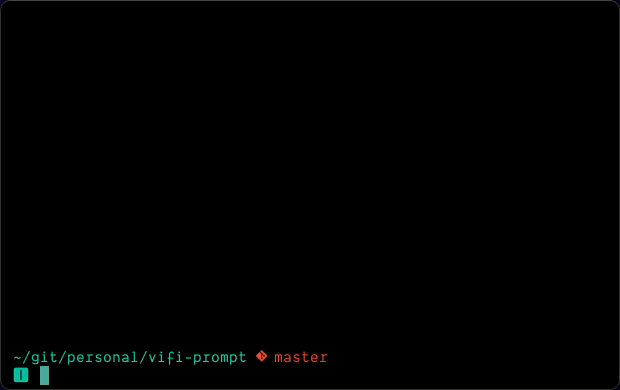

# vifi-prompt

`vifi` is a portmandeau of 'Vi' and 'Fish', because it's a prompt for Fish shell,
primarily focused around showing proper indicators when using Vi key bindings.



## Install

```
cargo install vifi-prompt
```
